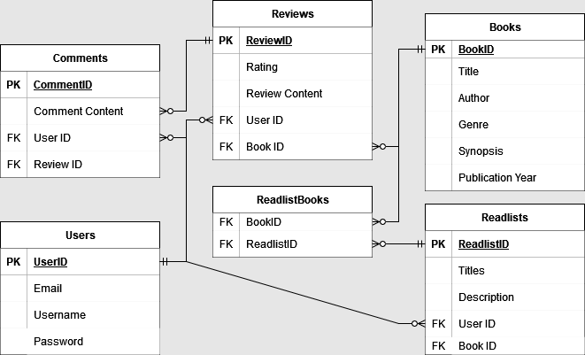

# BenPhillips-T2A2

R1 	Identification of the problem you are trying to solve by building this particular app.

This app is not necessarily trying to solve a problem, I would rather say that it's fulfilling a gap in the market. The gap being that there isn't a popular application out right now that is designed for connecting book lovers and creating a social network centred around books. 

R2 	Why is it a problem that needs solving?

There are several reasons why I think this problem needs addressing. Firstly, it can be very difficult sometimes for readers to find books that they want to read so if they're able to connect with like minded individuals then it will be easier for them to choose books that are more suited to their interests. Moreover, there is a lack of a centralised book social network so I think this app would be able to create this community that many book lovers would appreciate. 

R3 Why have you chosen this database system. What are the drawbacks compared to others?

For my project I have chosen to use SQL to create a relational database system. I have chosen SQL for various reasons. SQL excels at handling structured data, the application requires data to be well-defined and organized and also needs clear relationships between entities so SQL is ideal for this. Moreover, the app needs all information to be accurate, robust and consistent, and SQL provides this by ensuring the integrity of all data by compliance with ACID properties. Transactions in SQL are secure and reliable so the data in my app will always be consistent. SQL also provides querying capabilities which the app needs for retrieving and manipulating data. On the other hand, in comparison to other database systems, a drawback of SQL is it's limited scalability. SQL can have issues scaling horizontally across multiple servers while a database system like NoSQL is designed for horizontal scaling so it's better suited to scalable apps with vast volumes of data. Moreover, the rigidity of SQL schemas can be a drawback as all schemas are fixed and data must be predefined. This is a challenge when data models are rapidly evolving or when an app requires flexibility to handle loosely structure data. In comparison, NoSQL offers schema-less models which allow for easy adapatation to changing data requirements. 

R4 	Identify and discuss the key functionalities and benefits of an ORM

A key functionality of an ORM is object-oriented data access. ORM enables developers to work with database entities as objects in their programming language. For example, for this project I will be using Python in order to interact with my relational database in SQL. Developers can use an ORM to manipulate data with concepts they're already familiar with such as classes, inheritance, and relationships this simplifying the developement process. ORM frameworks (such as Flask for this project) allow for data modeling and schema generation. They provide means for defining data models using high-level abstractions like classes and attributes. With a defined model, the ORM can generate the database schema. This maintains the consistency of the data in the applications data model and the database schema. Additionally, ORM frameworks can take care of data relationships and inregrity. ORMs can handle the mapping of all types of data relationships such as many-to-one, one-to-one etc. ORMs can do this by enforcing referential integrity constraints and managing foreign key relationships. Therefore, managing complicated data relationships is simplified, data is more consistent and manual error-prone code can be avoided. 

R5 	Document all endpoints for your API

    Books:
        GET /books: Retrieve a list of books
        GET /books/{bookId}: Retrieve details of a specific book
        POST /books: Create a new book
        PUT /books/{bookId}: Update details of a specific book
        DELETE /books/{bookId}: Delete a specific book

    Reviews:
        GET /books/{bookId}/reviews: Retrieve reviews for a specific book
        GET /reviews/{reviewId}: Retrieve details of a specific review
        POST /books/{bookId}/reviews: Create a new review for a specific book
        PUT /reviews/{reviewId}: Update details of a specific review
        DELETE /reviews/{reviewId}: Delete a specific review

    Comments:
        GET /reviews/{reviewId}/comments: Retrieve comments for a specific review
        GET /comments/{commentId}: Retrieve details of a specific comment
        POST /reviews/{reviewId}/comments: Create a new comment for a specific review
        PUT /comments/{commentId}: Update details of a specific comment
        DELETE /comments/{commentId}: Delete a specific comment

    Users:
        GET /users: Retrieve a list of users
        GET /users/{userId}: Retrieve details of a specific user
        POST /users: Create a new user
        PUT /users/{userId}: Update details of a specific user
        DELETE /users/{userId}: Delete a specific user

    Readlists:
        GET /users/{userId}/readlists: Retrieve readlists for a specific user
        GET /readlists/{readlistId}: Retrieve details of a specific readlist
        POST /users/{userId}/readlists: Create a new readlist for a specific user
        PUT /readlists/{readlistId}: Update details of a specific readlist
        DELETE /readlists/{readlistId}: Delete a specific readlist

R6 	An ERD for your app

R7 	Detail any third party services that your app will use

The API requires various third party services in order to function. I will be using Flask, a web framework that provides a set of tools, libraries and conventions used for making web applications. Flask is for Python and is known for its flexibility and simplicity. Flask will be useful for its extension, routing, and request handling capabilities in this project. SQLAlchemy is an Object-Relational Mapping (ORM) library for Python that will be utilised in the project. This service will allow me to interact with my databases by using Python objects. Flask-JWT-Extended is a Flask extension that provides support for creating JSON Web Tokens (JWT) for the authentication and authorization required in the app. The Token is attached to a specific user and is used to validate whether or not they are who they claim to be. BCrypt is a password-hashing library for securing, storing and verifying passwords. It will be used to protect user credentials. Finally, Marshmallow is an object serialization-deserialization library for Python. It is used for converting complex data types like objects into JSON making them compatible with the API. 

R8 	Describe your projects models in terms of the relationships they have with each other

Users to Reviews uses a One-to-Many relationship as each user can have multiple reviews, but each review belongs to only one user. Users to Comments utilizes a One-to-Many relationship. Each user can post multiple comments, but each comment belongs to only one user. Users to Readlists is a One-to-Many relationship. Each user can create multiple readlists, but each readlist belongs to only one user. Books to Reviews has a One-to-Many relationship. Each book can have multiple reviews, but each review belongs to only one book. Books to ReadlistBooks uses a Many-to-Many relationship. Each book can be associated with multiple readlists, and each readlist can contain multiple books. Finally, Reviews to Comments is a One-to-Many relationship. Each review can have multiple comments, but each comment belongs to only one review.

R9 	Discuss the database relations to be implemented in your application

 Users to reviews, I chose this relationship as I wanted each user to be able to write multiple reviews and since each review belongs to them no other user can edit what they've written. For Users to Comments, each comment belongs to one user so users can know who wrote it and can't edit it. Users to readlists, I want users to be able to make as many readlists as they want so the relationship I've chosen is appropriate as they belong to the user nobody else can change them. Books to reviews, it would be lame if a book could only be reviewed one time hence each book can have multiple reviews. A review can only belong to one book as it would be confusing otherwise. Books to ReadlistBooks relationship allows any user to put a book in their own readlist and allows for every readlist to have various books in it.  Reviews to Comments relationship is designed so reviews can be commented on by various users and so a comment can only be in one review to avoid confusion.

R10 	Describe the way tasks are allocated and tracked in your project

I started work on this project on June 24rd so the following plan is designed with that in mind.

Day 1 (June 24th):

    Complete all initial project documentation and planning
        Define the project objectives, scope, and target audience.
        Identify the core features and functionality required for the API.
        Create ERD
        Define API endpoints
        Answer all necessary documentation questions

Day 2 (June 25th):

    Set up the development environment, including programming languages and frameworks.
    Create a Git repository
    Implement the foundational API structure and basic endpoints.

Day 3 (June 26th):

    Develop authentication and authorization mechanisms for the API.
    Implement additional API endpoints based on the defined specifications.
    Handle validation and error handling for API requests.

Day 4 (June 27th):

    Implement database integration.
    Ensure data security and privacy measures are in place.
    Write integration tests to verify API functionality and data interactions.

Day 5 (June 28th):

    Perform API testing and debugging to ensure proper functionality.
    Document the API endpoints, request/response formats, and usage examples.
    Review and refactor code for quality and maintainability.

Day 6 (June 29th):

    Conduct thorough testing of the API, including functional, integration, and performance testing.
    Fix any identified bugs or issues and retest the fixed functionality.
    Prepare the API for deployment, including configuration setup and environment preparation.

Day 7 (June 30th):

    Deploy the API to a suitable production environment.
    Set up logging and monitoring tools to track API performance.
    Finalize the API documentation, including detailed usage instructions and code examples.

Day 8 (July 1st):

    Conduct a final review of the API's documentation and ensure it is accurate and up to date.
    Address any outstanding issues or bugs found during testing and deployment.

Day 9 (July 2nd):

    Finalise all documentation
    Upload project